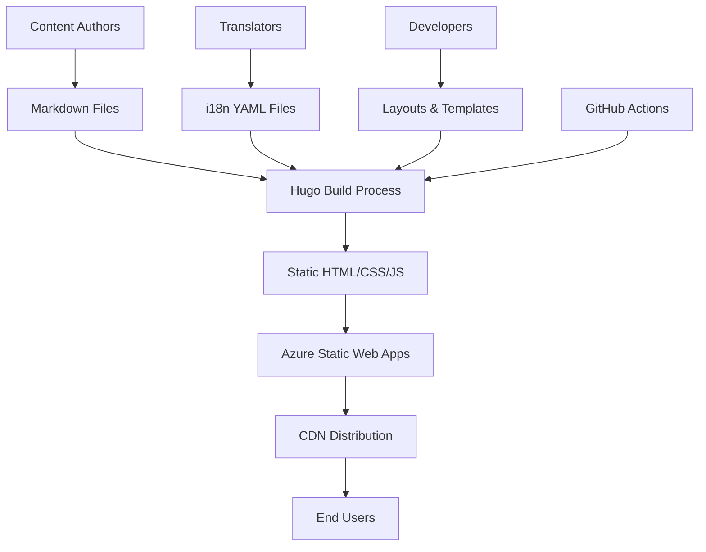

# 🏗️ Architecture Overview

This document provides a detailed overview of the Open Guide to Kanban's technical architecture and design decisions.

## Technology Stack

### Core Technologies

- **[Hugo](https://gohugo.io/)** - Static site generator (Extended v0.146.0+ required for new template system)
- **[Bootstrap 5](https://getbootstrap.com/)** - CSS framework for responsive design
- **[Font Awesome](https://fontawesome.com/)** - Icon library
- **[Azure Static Web Apps](https://azure.microsoft.com/services/app-service/static/)** - Hosting platform

### Development Tools

- **Git** - Version control
- **GitHub Actions** - CI/CD pipeline
- **PowerShell** - Scripting and automation
- **Markdown** - Content authoring

## System Architecture



## Directory Structure Deep Dive

### `/site/` - Hugo Source

The main Hugo site directory containing all source files:

```text
site/
├── content/                        # Markdown content files
│   ├── _index.md                  # Homepage content
│   ├── open-guide-to-kanban/      # Open Guide to Kanban
│   │   ├── _index.md             # Section index
│   │   ├── 2025.7/               # Versioned release
│   │   │   ├── index.md         # English content
│   │   │   ├── index.es-419.md  # Spanish (Latin America)
│   │   │   └── index.ja.md      # Japanese (etc.)
│   │   ├── history/              # Archived versions
│   │   └── translations/         # Translation index pages
│   └── the-kanban-guide/          # The Kanban Guide
│       ├── _index.md             # Section index
│       ├── 2025.5/               # Latest versioned release
│       ├── 2020.12/              # Historical versions
│       ├── 2020.7/
│       ├── history/
│       └── translations/
├── static/                         # Static assets
│   ├── css/                       # Custom stylesheets
│   └── images/                    # Images and graphics
├── data/                           # Structured data files
│   └── contributions/             # Contributor data per guide
│       ├── open-guide-to-kanban.yml
│       └── the-kanban-guide.yml
├── i18n/                           # Translation files
│   ├── en.yaml
│   ├── es-419.yaml
│   ├── ja.yaml
│   └── ...                        # Other language files
├── go.mod                          # Hugo module definition
└── hugo.yaml                       # Hugo configuration
```

> **Note**: This project has no local `layouts/` directory. All templates, partials, shortcodes, and render hooks are provided by the **HugoGuides Hugo module** (`github.com/nkdAgility/HugoGuides/module`), declared in `site/go.mod`. Run `hugo mod download` after cloning to fetch it.

### `/docs/` - Documentation

Comprehensive project documentation for contributors and maintainers.

### `/public/` - Generated Output

Auto-generated static site files (not committed to version control in production).

### Configuration Files

- `hugo.yaml` - Main Hugo configuration
- `hugo.*.yaml` - Environment-specific configurations
- `staticwebapp.config.*.json` - Azure Static Web Apps configurations

## Content Architecture

### Multilingual Support

The site supports multiple languages using Hugo's built-in i18n features:

- **English** (`en`) - Default language
- **Japanese** (`ja`) - 日本語
- **Spanish Latin America** (`es-419`) - Español (Latinoamérica)
- **Spanish Spain** (`es-ES`) - Español (España)
- **Farsi/Persian** (`fa`) - فارسی (RTL)
- **Polish** (`pl`) - Polski
- **Minionese** (`min`) - reference/fun implementation

Active languages per environment are controlled in `hugo.production.yaml` via `disabled: true/false`.

### Content Types

1. **Guide Content** - The two Kanban guides with versioned releases
2. **History Pages** - Archived versions of each guide
3. **Translation Index Pages** - Per-guide translation listings

## Template System

All templates are provided by the **HugoGuides module** (`github.com/nkdAgility/HugoGuides/module`). There is no local `layouts/` directory in this repo. The module uses Hugo v0.146.0+'s template system:

- Templates live in `_partials/`, `_shortcodes/`, `_markup/` within the module
- Base template is `baseof.html`, homepage is `home.html`
- Hugo's lookup order: custom layout → page kind → standard layouts → output format → language → path

To update templates, changes must be made in the [HugoGuides module repository](https://github.com/nkdAgility/HugoGuides) and a new version imported via `hugo mod get`.

## Build Process

### Development Build

```bash
# From the project root
hugo serve --source site --config hugo.yaml,hugo.local.yaml
```

### Production Build

```bash
# From the project root
hugo --source site --config hugo.yaml,hugo.production.yaml --minify
```

### Environment Configurations

- **Local** (`hugo.local.yaml`) - Development settings
- **Preview** (`hugo.preview.yaml`) - Preview/staging settings
- **Canary** (`hugo.canary.yaml`) - Canary release settings
- **Production** (`hugo.yaml`) - Production settings

## Deployment Architecture

### Azure Static Web Apps

The site is deployed using Azure Static Web Apps with:

- **Automatic builds** from GitHub Actions
- **Custom domains** support
- **SSL certificates** automatically managed
- **CDN distribution** globally
- **Environment-specific deployments**

### Deployment Environments

1. **Production** - Main live site
2. **Preview** - Staging environment
3. **Canary** - Early access features

## Performance Considerations

### Optimization Strategies

- **Static generation** - No server-side processing
- **Minification** - CSS, JS, and HTML minification
- **Image optimization** - Responsive images and WebP support
- **CDN delivery** - Global content distribution
- **Caching headers** - Aggressive caching for static assets

### Build Performance

- **Incremental builds** during development
- **Asset bundling** and minification
- **Template caching** for faster rebuilds

## Security Architecture

### Content Security

- **Static files only** - No server-side vulnerabilities
- **HTTPS only** - All traffic encrypted
- **CSP headers** - Content Security Policy implementation

### Access Control

- **Repository access** - GitHub permissions
- **Deployment access** - Azure permissions
- **Review process** - Pull request requirements

## Monitoring and Analytics

### Built-in Monitoring

- **Google Analytics** - Traffic and user behavior
- **Azure Application Insights** - Performance monitoring
- **GitHub Actions** - Build and deployment status

### Content Metrics

- **Page views** per language
- **Download statistics** for PDFs
- **User engagement** metrics

## Extensibility

### Adding New Languages

1. Create new i18n file in `site/i18n/{lang}.yaml`
2. Add language configuration in `site/hugo.yaml`
3. Create translated content files in each guide's version directory
4. Use the `@tranguide.create` agent for automated setup

### Adding New Content Types

New content types require template changes in the HugoGuides module, not in this repo. Raise an issue or PR against [github.com/nkdAgility/HugoGuides](https://github.com/nkdAgility/HugoGuides).

### Custom CSS/JS

Custom styles go in `site/static/css/style.css`. The module provides the base Bootstrap 5 + Font Awesome setup.

## Future Considerations

### Scalability

- **Content growth** - Efficient content organization
- **Language expansion** - Additional translations
- **Feature additions** - New content types and functionality

### Technology Updates

- **Hugo updates** - Regular framework updates
- **Dependency management** - Bootstrap and other libraries
- **Security patches** - Keeping dependencies current

---

🔙 **Back to**: [Documentation Home](./README.md)  
➡️ **Next**: [Development Guide](./development.md)
